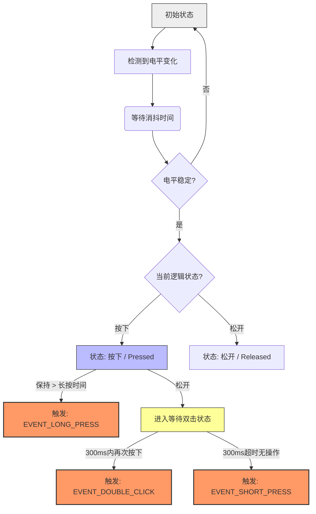

> 
>

### 第一节 GPIO

#### **一、GPIO 基本电气特性**

1. **逻辑电平**：所有GPIO引脚均工作在 **3.3V TTL 电平**。输出高电平为~3.3V，低电平为0V。输入引脚识别的高电平阈值最低约为0.75 * VDD（约2.5V），**严禁直接接入5V信号**，否则将永久损坏芯片。
2. **驱动能力**：每个引脚可配置为源电流（source）或吸电流（sink）。单个引脚最大直流电流为**40mA**。所有引脚总电流有严格限制（具体值需查阅对应型号的数据手册，例如ESP32-D0WD约为1.2A）。驱动任何超过20mA的负载（如电机、多颗LED）必须使用外部驱动电路（如MOSFET、晶体管或驱动IC）。
3. **引脚状态**：多数引脚内置可编程上拉/下拉电阻（约45kΩ），可通过软件（`pinMode(pin, INPUT_PULLUP)`）或外部电阻配置，避免悬空时状态不确定。

#### **二、GPIO 功能模式与复用架构**

ESP32的GPIO是一个高度复用的系统。一个物理引脚可通过 **IO MUX** 和 **GPIO 交换矩阵** 路由到多个内部外设。这是其灵活性的核心。

**主要功能模式：**

| 模式                   | 配置函数 (Arduino核心)                                       | 功能描述                                                   | 关键注意事项                                                 |
| :--------------------- | :----------------------------------------------------------- | :--------------------------------------------------------- | :----------------------------------------------------------- |
| **数字输入**           | `pinMode(pin, INPUT)`                                        | 读取数字状态（高/低电平）。                                | 可启用内部上/下拉电阻。响应速度最快。                        |
| **数字输出**           | `pinMode(pin, OUTPUT)` `digitalWrite(pin, state)`            | 输出数字电平。                                             | 注意电流驱动能力限制。                                       |
| **模拟输入 (ADC)**     | `analogRead(pin)`                                            | 将外部电压（0V-3.3V）转换为数字值（默认12位，0-4095）。    | **非全部引脚支持**。注意衰减器配置和参考电压。存在固有噪声，需软件滤波。 |
| **模拟输出 (DAC)**     | `dacWrite(pin, value)`                                       | 通过内置8位DAC输出0-3.3V模拟电压。                         | **仅 GPIO25, GPIO26** 两个引脚支持。                         |
| **脉冲宽度调制 (PWM)** | `ledcSetup(channel, freq, bits)` `ledcAttachPin(pin, channel)` | 通过LED控制（LEDC）外设生成PWM信号，用于调光、舵机控制等。 | 独立于引脚，需绑定到16个LEDC通道之一。精度和频率可调。       |
| **电容式触摸传感**     | `touchRead(pin)`                                             | 检测引脚电容变化，实现触摸输入。                           | **特定引脚支持**（如GPIO2, 4, 12-15, 27, 32-33）。高灵敏度，易受干扰。 |
| **特殊外设功能**       | 专用库（Wire, SPI等）                                        | 作为硬件通信接口（UART, I2C, SPI, I2S, SDIO等）的引脚。    | **引脚映射固定或部分可配置**。需查阅官方外设引脚分配表。     |

#### **三、关键引脚与启动配置**

部分GPIO在芯片上电启动（Boot）或固件下载（Flash）时具有特殊功能，**必须在电路设计和程序中使用时优先考虑其约束**。

| 引脚       | 启动/下载状态                                            | 使用建议                                                     |
| :--------- | :------------------------------------------------------- | :----------------------------------------------------------- |
| **GPIO0**  | 必须为高电平才能进入正常启动模式；低电平时进入下载模式。 | 可接按钮（对地）用于手动触发下载，但**常态必须通过电阻上拉至高电平**。 |
| **GPIO2**  | 启动时需为高电平，且内部已弱上拉。                       | 通常连接板载LED，避免在启动时外接强下拉电路。                |
| **GPIO5**  | 影响SPI Flash电压配置。                                  | 确保其外围电路与Flash电压匹配。                              |
| **GPIO12** | 上电时的电平决定Flash电压（高=3.3V，低=1.8V）。          | 对于绝大多数3.3V Flash的开发板，**必须保持外部上拉或悬空（内部上拉）**。 |
| **GPIO15** | 内部下拉，禁止外部强行上拉。                             | 严格遵守设计，避免与启动流程冲突。                           |

**最佳实践**：在项目初期，优先使用“安全”的通用GPIO（如GPIO4, 5, 13-19, 21-23, 25-27, 32-33），避开上述启动配置引脚，除非你明确理解其功能并进行了相应处理。

#### 四、数字IO基础函数

在ESP32的Arduino框架下，数字IO操作主要使用以下三个核心函数：

##### 1. **pinMode(pin, mode) - 引脚模式配置**

设置指定GPIO引脚的工作模式。

**参数：**

- `pin`：GPIO引脚编号（整数）
- `mode`：工作模式（以下之一）
  - `INPUT`：数字输入模式，用于读取外部信号
  - `OUTPUT`：数字输出模式，用于控制外部设备
  - `INPUT_PULLUP`：输入模式并启用内部上拉电阻
  - `INPUT_PULLDOWN`：输入模式并启用内部下拉电阻

**示例：**

```cpp
pinMode(2, OUTPUT);      // 将GPIO2设置为输出模式
pinMode(4, INPUT);       // 将GPIO4设置为输入模式
pinMode(5, INPUT_PULLUP); // 将GPIO5设置为输入模式并启用内部上拉电阻
```

##### 2. **digitalWrite(pin, value) - 数字输出**

向指定的输出引脚写入高低电平。

**参数：**

- `pin`：GPIO引脚编号
- `value`：输出电平
  - `HIGH` 或 `1`：输出3.3V高电平
  - `LOW` 或 `0`：输出0V低电平

**示例：**

```cpp
digitalWrite(2, HIGH);   // GPIO2输出高电平（3.3V）
digitalWrite(2, LOW);    // GPIO2输出低电平（0V）
```

##### 3. **digitalRead(pin) - 数字输入**

读取指定输入引脚的当前电平状态。

**参数：**

- `pin`：GPIO引脚编号

**返回值：**

- `HIGH` 或 `1`：引脚检测到高电平（>≈2V）
- `LOW` 或 `0`：引脚检测到低电平（<≈0.8V）

**示例：**

```cpp
int state = digitalRead(4);  // 读取GPIO4的当前电平
```

##### LED与按钮交互

```cpp
// ESP32数字IO基础教学示例
// 硬件连接：
// - LED正极接GPIO2，负极通过220Ω电阻接地
// - 按钮一端接GPIO15，另一端接地

const int LED_PIN = 2;       // LED连接的引脚
const int BUTTON_PIN = 15;   // 按钮连接的引脚

void setup() {
  Serial.begin(115200);      // 初始化串口通信
  
  // 配置引脚模式
  pinMode(LED_PIN, OUTPUT);           // LED引脚设为输出
  pinMode(BUTTON_PIN, INPUT_PULLUP);  // 按钮引脚设为输入并启用内部上拉
  
  Serial.println("ESP32数字IO基础演示开始");
}

void loop() {
  // 读取按钮状态（使用上拉电阻时，按下为LOW，松开为HIGH）
  int buttonState = digitalRead(BUTTON_PIN);
  
  // 按钮按下时点亮LED，松开时熄灭
  if (buttonState == LOW) {
    digitalWrite(LED_PIN, HIGH);  // 点亮LED
    Serial.println("按钮按下 - LED亮");
  } else {
    digitalWrite(LED_PIN, LOW);   // 熄灭LED
    Serial.println("按钮松开 - LED灭");
  }
  
  delay(100);  // 短延时防止过于频繁的检测
}
```

### 第二节 PWM

### 一、PWM工作原理

#### 1. PWM基本概念

脉冲宽度调制（PWM）是一种通过数字方式生成模拟效果的技术。核心思想是：通过快速开关数字信号，控制高电平和低电平的时间比例，从而在输出端获得不同的平均电压。

#### 2. 三个核心参数

- **周期与频率**：
  周期是完成一个完整开关循环的时间，频率是周期的倒数（单位Hz）。例如，1kHz频率对应1ms周期。
- **占空比**：
  高电平时间占整个周期的百分比。计算公式：占空比 = (高电平时间 / 总周期时间) × 100%。
- **分辨率**：
  占空比可调节的精细程度。用位数表示，如8位分辨率提供256级（0-255）占空比调节。

#### 3. 物理效应

当PWM信号驱动LED、电机等惯性元件时，由于人眼视觉暂留或电机机械惯性，它们会对快速变化的信号做出平均响应。50%占空比的3.3V PWM信号，在负载上产生的效果近似于1.65V的连续电压。

#### 4. ESP32的LEDC外设

ESP32使用专门的LED PWM控制器（LEDC）生成PWM信号，主要特性：

- 16个独立通道（编号0-15）
- 2个高速定时器（定时器0和1）
- 每个通道可独立配置频率和分辨率
- 任意通道可绑定到大多数GPIO引脚

### 二、PWM驱动函数详解

#### 1. ledcSetup() - 配置PWM通道

```cpp
double ledcSetup(uint8_t channel, double freq, uint8_t resolution_bits);
```

**功能**：配置指定通道的PWM参数。

**参数**：

- `channel`：LEDC通道编号，范围0-15
- `freq`：PWM频率，单位Hz。实际支持范围取决于时钟源和分辨率
- `resolution_bits`：分辨率位数，范围1-16。决定占空比调节精度

**返回值**：实际设置的频率（double）。由于硬件限制，实际频率可能与请求频率略有差异。

**频率与分辨率限制**：

```cpp
最大频率 = 时钟源频率 / (2^resolution_bits)
常用时钟源80MHz，则：
- 8位分辨率时最大频率：80,000,000 / 256 ≈ 312.5kHz
- 10位分辨率时最大频率：80,000,000 / 1024 ≈ 78.125kHz
```

**示例**：

```cpp
// 配置通道0：5kHz频率，8位分辨率
ledcSetup(0, 5000, 8);

// 配置通道1：50Hz频率，12位分辨率（适用于舵机）
ledcSetup(1, 50, 12);
```

#### 2. ledcAttachPin() - 绑定引脚到通道

```cpp
void ledcAttachPin(uint8_t pin, uint8_t channel);
```

**功能**：将物理GPIO引脚连接到指定的LEDC通道。

**参数**：

- `pin`：GPIO引脚编号
- `channel`：LEDC通道编号

**重要规则**：

- 一个通道可绑定到多个引脚（输出相同PWM信号）
- 一个引脚同一时间只能绑定到一个通道
- 大多数GPIO都支持PWM输出（除仅输入引脚34-39）

**示例**：

```cpp
// 将GPIO2绑定到通道0
ledcAttachPin(2, 0);

// 将GPIO4和GPIO5都绑定到通道1
ledcAttachPin(4, 1);
ledcAttachPin(5, 1);  // GPIO4和GPIO5将输出相同的PWM信号
```

#### 3. ledcWrite() - 设置占空比

```cpp
void ledcWrite(uint8_t channel, uint32_t duty);
```

**功能**：设置指定通道的占空比值。

**参数**：

- `channel`：LEDC通道编号
- `duty`：占空比值，范围0到(2^resolution_bits - 1)

**占空比计算**：

```cpp
实际占空比百分比 = duty / (2^resolution_bits) × 100%

例如：8位分辨率时
- duty=0   → 占空比 0%
- duty=64  → 占空比 25%
- duty=128 → 占空比 50%
- duty=192 → 占空比 75%
- duty=255 → 占空比 100%
```

**示例**：

```cpp
// 8位分辨率下设置50%占空比
ledcWrite(0, 128);

// 12位分辨率下设置25%占空比（4096×0.25=1024）
ledcWrite(1, 1024);
```

#### 4. 辅助函数

```cpp
// 读取通道当前占空比值
uint32_t ledcRead(uint8_t channel);

// 读取通道当前实际频率
uint32_t ledcReadFreq(uint8_t channel);

// 解除引脚绑定
void ledcDetachPin(uint8_t pin);

// 停止通道输出（等效于占空比设为0）
void ledcWrite(channel, 0);
```

### 第三节 模拟信号

### 一、ADC（模数转换器）原理

#### 1. 模数转换的基本概念

ADC（模数转换器）将连续的模拟电压信号转换为离散的数字数值，这一过程包含三个核心步骤：

1. **采样**：以固定时间间隔捕获输入信号的瞬时电压值。根据奈奎斯特采样定理，采样频率必须至少为信号最高频率成分的两倍，才能无失真地还原信号。ESP32的ADC最大采样率约为200ksps（每秒千次采样）。
2. **量化**：将采样得到的连续电压值映射到有限的离散电平值上。ESP32的ADC具有12位分辨率，即将电压范围划分为4096（2¹²）个离散的量化等级。每个等级之间的电压差称为LSB（最低有效位），计算公式为LSB=Vref/4096。
3. **编码**：为每个量化等级分配一个唯一的二进制数字代码，通常采用直接二进制编码。例如，在3.3V参考电压下，0V对应二进制000000000000（十进制0），3.3V对应二进制111111111111（十进制4095）。

#### 2. ESP32的SAR-ADC原理

ESP32采用逐次逼近寄存器型ADC（SAR-ADC），其工作原理基于二分搜索算法：

```
1. 初始化：未知输入电压Vin
2. 步骤1：内部DAC输出Vref/2，比较器判断Vin > Vref/2？
3. 步骤2：若Vin > Vref/2，则DAC输出3Vref/4；否则输出Vref/4
4. 步骤3-12：重复上述二分搜索过程
5. 12步后：确定12位数字输出值
```

**关键特性参数**：

- **分辨率**：12位（可通过软件配置为9-12位）
- **参考电压**：内部基准约1.1V，通过可编程衰减器扩展量程
- **非线性误差**：微分非线性（DNL）约±2LSB，积分非线性（INL）约±6LSB
- **有效位数**：实际有效位数约9.5位，主要受内部噪声限制
- **输入阻抗**：约100kΩ，随衰减器设置变化

#### 3. 衰减器与量程配置

ESP32 ADC通过可编程衰减器适应不同范围的输入电压，衰减器本质上是分压网络：

| 衰减设置  | 分压比  | 理论最大量程 | 推荐工作范围 | 典型应用           |
| :-------- | :------ | :----------- | :----------- | :----------------- |
| ADC_0db   | 1:1     | 0-1.1V       | 0-0.8V       | 低电压传感器       |
| ADC_2_5db | ~1:1.33 | 0-1.5V       | 0-1.2V       | 电池电压监测       |
| ADC_6db   | ~1:2    | 0-2.2V       | 0-1.8V       | 通用信号测量       |
| ADC_11db  | ~1:3.6  | 0-3.3V       | 0-2.6V       | 全量程测量（默认） |

### 二、ADC驱动函数详解

#### 1. 核心函数列表与说明

**基础读取函数**：

```cpp
int analogRead(uint8_t pin);
```

- **功能**：读取指定引脚的ADC原始值
- **参数**：`pin` - GPIO引脚编号（0-39，但仅特定引脚支持ADC）
- **返回值**：ADC原始值，范围取决于设置的分辨率
- **示例**：`int value = analogRead(34); // 读取GPIO34`

**配置函数组**：

```cpp
void analogReadResolution(uint8_t bits);
```

- **功能**：设置ADC输出数字值的位数
- **参数**：`bits` - 分辨率位数，有效范围9-12
- **注意**：此设置仅改变输出数值的范围，不影响ADC实际精度
- **示例**：`analogReadResolution(12); // 输出0-4095`

```cpp
void analogSetAttenuation(adc_attenuation_t attenuation);
```

- **功能**：配置ADC输入衰减器，决定电压测量范围
- **参数**：`attenuation` - 衰减级别，取以下值之一：
  - `ADC_0db` // 最小衰减，适合0-0.8V信号
  - `ADC_2_5db` // 低衰减，适合0-1.2V信号
  - `ADC_6db` // 中衰减，适合0-1.8V信号
  - `ADC_11db` // 高衰减，适合0-2.6V信号（默认）
- **示例**：`analogSetAttenuation(ADC_11db);`

**性能调节函数**：

```cpp
void analogSetClockDiv(uint8_t clockDiv);
```

- **功能**：设置ADC时钟分频系数
- **参数**：`clockDiv` - 分频值（1-255），1为最快
- **影响**：较低的分频值提高采样率但可能增加噪声
- **示例**：`analogSetClockDiv(1); // 最大采样率`

```cpp
void analogSetCycles(uint8_t cycles);
```

- **功能**：设置每个采样的时钟周期数
- **参数**：`cycles` - 周期数（1-255）
- **影响**：较多的周期数提高精度但降低采样率
- **示例**：`analogSetCycles(8); // 默认值`

```cpp
void analogSetSamples(uint8_t samples);
```

- **功能**：设置硬件自动平均的采样次数
- **参数**：`samples` - 采样次数（1-64）
- **影响**：多次平均可有效降低随机噪声，提高信噪比
- **示例**：`analogSetSamples(16); // 16次硬件平均`

### 三、DAC（数模转换器）原理

#### 1. 数模转换的基本原理

DAC（数模转换器）将数字代码转换为模拟电压输出，ESP32采用电阻串型DAC结构：

**转换过程**：

1. **数字输入**：8位二进制代码（0-255）
2. **译码选择**：译码器根据输入代码选择电阻串的对应抽头
3. **分压输出**：电阻串提供256个等间距的分压点
4. **缓冲输出**：经过输出缓冲器驱动外部负载

**数学关系**：

```
Vout = (D / 255) × Vref
其中：
  D = 数字输入值 (0-255)
  Vref = 参考电压 (3.3V)
```

#### 2. ESP32 DAC技术规格

- **分辨率**：8位（256个输出电平）
- **输出电压范围**：0 - Vref（Vref = 3.3V）
- **建立时间**：< 10μs（达到目标值90%所需时间）
- **输出阻抗**：约10kΩ（需外部缓冲器驱动低阻抗负载）
- **积分非线性**：< ±2LSB（最坏情况）
- **微分非线性**：< ±1LSB（保证单调性）
- **输出电压误差**：±10mV（典型值）

#### 3. 输出特性与负载考虑

ESP32 DAC的输出结构：

```
DAC核心 → 输出缓冲 → 串联电阻 → GPIO引脚
                  10kΩ
```

- **最大输出电流**：约±5mA（直接驱动能力有限）

- **容性负载限制**：建议< 50pF（保持稳定性）

- **外部缓冲建议**：

  ```cpp
  // 推荐电路：DAC引脚 → 10k电阻 → 运放同相输入端
  // 运放配置为电压跟随器，提供低阻抗输出
  ```

### 四、DAC驱动函数详解

#### 1. 核心函数列表与说明

**基础输出函数**：

```cpp
void dacWrite(uint8_t pin, uint8_t value);
```

- **功能**：设置DAC输出值
- **参数**：
  - `pin` - GPIO引脚编号，仅支持25或26
  - `value` - 输出值，范围0-255
- **输出电压**：Vout = (value / 255) × 3.3V
- **示例**：`dacWrite(25, 128); // 输出1.65V`

**ESP-IDF底层函数**：

```cpp
// 启用DAC通道
void dac_output_enable(dac_channel_t channel);
```

- **功能**：启用指定DAC通道
- **参数**：`channel` - DAC通道，`DAC_CHANNEL_1`（GPIO25）或`DAC_CHANNEL_2`（GPIO26）
- **注意**：此函数在Arduino框架中自动调用

```cpp
// 直接电压输出
void dac_output_voltage(dac_channel_t channel, uint8_t dac_value);
```

- **功能**：直接设置DAC输出值
- **参数**：
  - `channel` - DAC通道
  - `dac_value` - 8位输出值
- **示例**：`dac_output_voltage(DAC_CHANNEL_1, 192); // GPIO25输出约2.48V`

### 第四节 触摸检测

### 一、触摸传感器原理

#### 1. 电容式触摸传感基本原理

ESP32的触摸传感器基于**电容变化检测**原理，属于电荷转移式电容传感器：

**工作原理流程**：

1. **电极电容构成**：触摸电极与地之间形成寄生电容Cp
2. **手指接近影响**：手指接近时，增加手指-电极电容Cf
3. **总电容变化**：总电容Ctotal = Cp + Cf
4. **充电时间变化**：电容增大导致充电时间常数τ = R×C增加
5. **检测机制**：测量电极充电到阈值电压所需的时间或脉冲计数

**电容模型**：

```
触摸电极 → 寄生电容Cp → 地
         ↘ 手指电容Cf → 手指 → 人体 → 大地
```

**电荷转移过程**：

```
阶段1：复位 - 电极放电到地
阶段2：充电 - 恒流源对电极充电
阶段3：测量 - 记录达到阈值的时间/脉冲数
阶段4：计算 - 原始计数值反映电容大小
```

#### 2. ESP32触摸传感器硬件架构

**内部结构**：

- **10个触摸传感器通道**：T0-T9，对应特定GPIO
- **可编程恒流源**：0.5-64μA，8级可调
- **施密特触发器**：提供阈值比较和数字输出
- **脉冲计数器**：16位，记录充电脉冲数
- **低通滤波器**：硬件滤波减少噪声

**触摸通道与GPIO对应关系**：

| 触摸通道 | GPIO引脚 | 触摸通道 | GPIO引脚 |
| :------- | :------- | :------- | :------- |
| T0       | GPIO4    | T5       | GPIO12   |
| T1       | GPIO0    | T6       | GPIO14   |
| T2       | GPIO2    | T7       | GPIO27   |
| T3       | GPIO15   | T8       | GPIO33   |
| T4       | GPIO13   | T9       | GPIO32   |

**关键电气参数**：

- **测量范围**：0-65535（16位计数器）
- **灵敏度**：可检测fF级电容变化
- **响应时间**：< 10ms（快速触摸检测）
- **扫描频率**：最高500Hz（所有通道）
- **功耗**：< 10μA/通道（睡眠模式）

#### 3. 触摸检测算法原理

**原始信号特性**：

- **无触摸基准值**：较稳定，受环境温湿度影响
- **触摸时变化**：计数值显著下降（电容增加）
- **噪声特征**：高频随机波动，50Hz工频干扰

**阈值检测算法**：

```
触摸状态 = 
    if (原始值 < 基准值 - 阈值) → 触摸中
    else → 无触摸
```

**基准值自适应更新**：

```
新基准值 = α×旧基准值 + (1-α)×当前值
α通常取0.95-0.99，实现慢速跟踪环境变化
```

### 二、触摸传感器函数详解

#### 1. 基础读取函数

**`touchRead(pin)`**

```cpp
uint16_t touchRead(uint8_t pin);
```

- **功能**：读取指定引脚的触摸原始值

- **参数**：`pin` - GPIO引脚编号（仅限触摸功能引脚）

- **返回值**：16位原始计数值（0-65535），值越小表示电容越大

- **采样时间**：约20ms（默认配置）

- **示例**：

  ```cpp
  uint16_t touchValue = touchRead(4);  // 读取T0（GPIO4）
  Serial.printf("触摸原始值: %u\n", touchValue);
  ```

**`touchReadRaw(pin)`**（更底层）

```cpp
uint32_t touch_pad_read_raw_data(touch_pad_t touch_num);
```

- **功能**：读取原始计数器值（不经过滤波）
- **参数**：`touch_num` - 触摸通道编号（TOUCH_PAD_NUM0-9）
- **返回值**：原始脉冲计数值
- **注意**：需要包含`driver/touch_sensor.h`

#### 2. 配置与初始化函数

**触摸传感器初始化**

```cpp
#include <driver/touch_sensor.h>

void setupTouchSensor() {
    // 初始化触摸传感器控制器
    touch_pad_init();
    
    // 配置触摸通道
    touch_pad_config(TOUCH_PAD_NUM0, 0);  // 通道0，阈值0（稍后设置）
    
    // 设置测量参数
    touch_pad_set_voltage(TOUCH_HVOLT_2V7, TOUCH_LVOLT_0V5, TOUCH_HVOLT_ATTEN_1V);
    
    // 设置充电电流和充电时间
    touch_pad_set_cnt_mode(TOUCH_PAD_NUM0, TOUCH_PAD_SLOPE_7, TOUCH_PAD_TIE_OPT_LOW);
    touch_pad_set_current(TOUCH_PAD_NUM0, TOUCH_PAD_CURR_32MA);
    
    // 启用中断
    touch_pad_isr_register(touchISR, NULL, TOUCH_PAD_INTR_MASK_ALL);
    touch_pad_intr_enable(TOUCH_PAD_INTR_MASK_ACTIVE | TOUCH_PAD_INTR_MASK_INACTIVE);
}
```

**电压范围设置**

```cpp
void touch_pad_set_voltage(
    touch_high_volt_t refh,      // 高参考电压
    touch_low_volt_t refl,       // 低参考电压  
    touch_volt_atten_t atten);   // 衰减系数
```

- **参数选项**：

  ```cpp
  // 高电压：2.4V, 2.5V, 2.6V, 2.7V
  TOUCH_HVOLT_2V4, TOUCH_HVOLT_2V5, TOUCH_HVOLT_2V6, TOUCH_HVOLT_2V7
  
  // 低电压：0V, 0.1V, 0.2V, 0.3V, 0.4V, 0.5V, 0.6V, 0.7V
  TOUCH_LVOLT_0V, TOUCH_LVOLT_0V1, ..., TOUCH_LVOLT_0V7
  
  // 衰减：0V, 0.25V, 0.5V, 1V
  TOUCH_HVOLT_ATTEN_0V, _0V25, _0V5, _1V
  ```

**充电参数设置**

```cpp
void touch_pad_set_cnt_mode(
    touch_pad_t touch_num,        // 触摸通道
    touch_cnt_slope_t slope,      // 充电斜率
    touch_tie_opt_t opt);         // 初始电平
```

- **斜率选项**：`TOUCH_PAD_SLOPE_0`到`TOUCH_PAD_SLOPE_7`（斜率递增）
- **初始电平**：`TOUCH_PAD_TIE_OPT_LOW`（从低充电）或`HIGH`

**充电电流设置**

```cpp
void touch_pad_set_current(
    touch_pad_t touch_num,        // 触摸通道
    touch_current_t current);     // 充电电流
```

- **电流选项**：

  ```cpp
  TOUCH_PAD_CURR_0MA5,  // 0.5μA
  TOUCH_PAD_CURR_1MA,   // 1μA
  TOUCH_PAD_CURR_2MA,   // 2μA
  TOUCH_PAD_CURR_4MA,   // 4μA
  TOUCH_PAD_CURR_8MA,   // 8μA
  TOUCH_PAD_CURR_16MA,  // 16μA
  TOUCH_PAD_CURR_32MA,  // 32μA
  TOUCH_PAD_CURR_64MA   // 64μA
  ```

#### 3. 滤波与校准函数

**硬件滤波器配置**

```cpp
void touch_pad_filter_start(uint32_t filter_period_ms);
void touch_pad_filter_stop(void);
void touch_pad_filter_delete(void);
```

- **滤波周期**：`filter_period_ms` - 滤波窗口时间（ms）
- **示例**：`touch_pad_filter_start(10); // 10ms滤波窗口`

### 第五节 WIFI

### 一、WiFi 工作原理

#### 1. 无线网络通信基础

**射频通信与调制**：
ESP32基于IEEE 802.11标准实现无线通信，核心是通过2.4GHz射频载波传输数据。发送端通过**调制**将数字信号转换为适合无线传输的模拟信号，接收端通过**解调**恢复原始数据。

**CSMA/CA协议**：
为避免数据冲突，WiFi使用载波侦听多路访问/冲突避免机制：

1. **载波侦听**：发送前检测信道是否空闲
2. **随机退避**：信道忙时等待随机时间再试
3. **虚拟载波侦听**：通过RTS/CTS帧预留信道

**信道与频段**：

- **2.4GHz频段**：2.412-2.484GHz，划分14个信道（中国用1-13）
- **信道带宽**：20MHz（802.11b/g/n）或40MHz（802.11n）
- **信道选择**：自动选择干扰最小的信道

#### 2. ESP32 WiFi硬件架构

**射频子系统**：

```
RF收发器 → 功率放大器/低噪放 → RF开关 → 天线
    ↓
基带处理器 → MAC处理器 → 主机接口(SPI/SDIO)
    ↓
   协议栈处理
```

**关键硬件特性**：

- **集成RF前端**：包含PA、LNA、RF开关，简化外部电路
- **天线选项**：支持PCB天线、陶瓷天线或外接天线
- **功耗管理**：支持多种省电模式（Active、Modem-sleep、Light-sleep）
- **处理能力**：集成Tensilica LX6处理器处理协议栈

**协议栈架构**：

```
应用层 (HTTP/MQTT)
    ↓
TCP/UDP层
    ↓
IP层
    ↓
数据链路层 (MAC)
    ↓
物理层 (PHY)
```

#### 3. 网络连接建立过程

**STA模式连接流程**：

1. **扫描阶段**：
   - 主动扫描：发送Probe Request帧
   - 被动扫描：监听Beacon帧
   - 获取可用AP列表及其参数
2. **认证阶段**：
   - Open System：无需密码
   - WPA/WPA2-PSK：预共享密钥认证
   - WPA2-Enterprise：企业级认证（需RADIUS服务器）
3. **关联阶段**：
   - 发送Association Request帧
   - AP回复Association Response
   - 建立逻辑连接，分配关联ID
4. **IP获取阶段**：
   - DHCP过程：Discover→Offer→Request→ACK
   - 或使用静态IP配置
   - 建立TCP/IP协议栈

### 二、WiFi 驱动函数详解

#### 1. 核心函数分类说明

**初始化与模式设置**：

```cpp
// 设置WiFi工作模式（必须在begin前调用）
bool WiFi.mode(wifi_mode_t mode);
// 参数选项：
// WIFI_MODE_NULL   - 关闭WiFi
// WIFI_MODE_STA    - 站点模式（连接路由器）
// WIFI_MODE_AP     - 接入点模式（创建热点）
// WIFI_MODE_APSTA  - 混合模式（同时作为STA和AP）

// 初始化WiFi（不同模式参数不同）
// STA模式：
wl_status_t WiFi.begin(const char* ssid, const char* passphrase = NULL, 
                       int32_t channel = 0, const uint8_t* bssid = NULL);
// AP模式：
bool WiFi.softAP(const char* ssid, const char* passphrase = NULL, 
                 int channel = 1, int ssid_hidden = 0, int max_connection = 4);
```

**连接状态管理**：

```cpp
// 获取当前连接状态（最核心函数）
wl_status_t WiFi.status();
// 返回值说明：
// WL_IDLE_STATUS      = 0,  // WiFi正在变更状态
// WL_NO_SSID_AVAIL    = 1,  // 无法找到指定SSID
// WL_SCAN_COMPLETED   = 2,  // 网络扫描完成
// WL_CONNECTED        = 3,  // 连接成功
// WL_CONNECT_FAILED   = 4,  // 连接失败
// WL_CONNECTION_LOST  = 5,  // 连接丢失
// WL_DISCONNECTED     = 6,  // 未连接
// WL_NO_SHIELD        = 255 // WiFi未初始化

// 断开连接
bool WiFi.disconnect(bool wifioff = false);
// wifioff=true时完全关闭WiFi，节省功耗

// 自动重连配置
void WiFi.setAutoReconnect(bool autoReconnect);
bool WiFi.getAutoReconnect();
```

**网络信息获取**：

```cpp
// IP地址相关
IPAddress WiFi.localIP();      // 本地IP地址
IPAddress WiFi.gatewayIP();    // 网关地址
IPAddress WiFi.subnetMask();   // 子网掩码
IPAddress WiFi.dnsIP(int dns_no = 0);  // DNS服务器地址

// 连接质量信息
int32_t WiFi.RSSI();  // 接收信号强度指示（负值，越大越好）
// 典型值：-30dBm（优秀），-67dBm（良好），-80dBm（较差）

String WiFi.BSSIDstr();  // 连接AP的MAC地址
String WiFi.SSID();      // 连接的网络名称
int32_t WiFi.channel();  // 当前信道

// MAC地址
String WiFi.macAddress();        // STA模式MAC地址
String WiFi.softAPmacAddress();  // AP模式MAC地址
```

**网络扫描功能**：

```cpp
// 启动网络扫描
int16_t WiFi.scanNetworks(bool async = false, 
                         bool show_hidden = false,
                         bool passive = false,
                         uint32_t max_ms_per_chan = 300,
                         uint8_t channel = 0);
// async=true: 异步扫描，立即返回
// show_hidden=true: 显示隐藏网络
// passive=true: 被动扫描，不发送探针

// 获取扫描结果
int16_t scanComplete();  // 返回找到的网络数量，-1表示扫描中
String WiFi.SSID(uint8_t i);  // 第i个网络的SSID
int32_t WiFi.RSSI(uint8_t i); // 第i个网络的信号强度
uint8_t* WiFi.BSSID(uint8_t i); // 第i个网络的MAC地址
wl_enc_type WiFi.encryptionType(uint8_t i); // 加密类型
int32_t WiFi.channel(uint8_t i); // 信道

// 清理扫描结果
void WiFi.scanDelete();
```

#### 2. 高级配置函数

**电源管理**：

```cpp
// 设置WiFi睡眠模式
bool WiFi.setSleep(bool enabled);
bool WiFi.setSleepMode(wifi_ps_type_t sleepMode);
// sleepMode选项：
// WIFI_PS_NONE        // 不睡眠，性能最佳，功耗最高
// WIFI_PS_MIN_MODEM   // 轻度睡眠，平衡功耗和性能
// WIFI_PS_MAX_MODEM   // 深度睡眠，功耗最低，唤醒延迟最大

// 设置发射功率
bool WiFi.setTxPower(wifi_power_t power);
// 功率等级：WIFI_POWER_19_5dBm（最大）到 WIFI_POWER_MINUS_1dBm
```

**连接参数优化**：

```cpp
// 设置最小安全级别
bool WiFi.setMinSecurity(wifi_auth_mode_t minSecurity);
// 例如：只连接WPA2及以上安全网络

// 配置扫描参数
bool WiFi.setScanMethod(wifi_scan_method_t scanMethod);
bool WiFi.setSortMethod(wifi_sort_method_t sortMethod);

// 设置带宽（影响传输速率）
bool WiFi.setBandwidth(wifi_bandwidth_t bandwidth);
// WIFI_BW_HT20: 20MHz带宽
// WIFI_BW_HT40: 40MHz带宽（需要信道支持）
```

#### 3. WiFi事件处理

**事件回调机制**：

```cpp
// 注册事件处理函数
WiFiEventId_t WiFi.onEvent(WiFiEventCb cbEvent, 
                          WiFiEvent_t event = ARDUINO_EVENT_WIFI_READY);

// 常用事件类型：
ARDUINO_EVENT_WIFI_STA_CONNECTED     // STA连接成功
ARDUINO_EVENT_WIFI_STA_DISCONNECTED  // STA断开连接
ARDUINO_EVENT_WIFI_STA_GOT_IP        // 获取到IP地址
ARDUINO_EVENT_WIFI_SCAN_DONE         // 扫描完成
ARDUINO_EVENT_WIFI_AP_STACONNECTED   // 有设备连接AP
ARDUINO_EVENT_WIFI_AP_STADISCONNECTED // 设备断开AP连接
```

**事件处理示例**：

```cpp
void WiFiEvent(WiFiEvent_t event) {
    switch(event) {
        case ARDUINO_EVENT_WIFI_STA_CONNECTED:
            Serial.println("已连接到AP");
            break;
        case ARDUINO_EVENT_WIFI_STA_DISCONNECTED:
            Serial.println("与AP断开连接");
            // 可在此触发重连逻辑
            break;
        case ARDUINO_EVENT_WIFI_STA_GOT_IP:
            Serial.print("获取IP: ");
            Serial.println(WiFi.localIP());
            break;
    }
}

// 在setup中注册
WiFi.onEvent(WiFiEvent);
```

### 三、综合示例：获取网络时间与天气

#### 1. 项目配置（platformio.ini）

```ini
[env:esp32dev]
platform = espressif32
board = esp32dev
framework = arduino
monitor_speed = 115200
upload_speed = 921600

lib_deps = 
    bblanchon/ArduinoJson@^6.21.3  # JSON解析库

build_flags = 
    -Wl,-Teagle.flash.4m.ld
```

#### 2. 完整程序代码

```cpp
/**
 * ESP32 网络时间与天气获取综合示例
 * 功能：1.WiFi连接 2.NTP时间同步 3.天气API调用
 * 硬件要求：ESP32开发板
 * 软件要求：PlatformIO + Arduino框架
 * API服务：和风天气（免费版）
 */

#include <WiFi.h>
#include <HTTPClient.h>
#include <ArduinoJson.h>

// ==================== 用户配置 ====================
// 1. WiFi配置
const char* WIFI_SSID = "Your_WiFi_SSID";
const char* WIFI_PASS = "Your_WiFi_Password";

// 2. 时间服务配置
const char* NTP_SERVER = "ntp.aliyun.com";  // 国内推荐
const long  GMT_OFFSET_SEC = 8 * 3600;      // 北京时间(UTC+8)
const int   DAYLIGHT_OFFSET_SEC = 0;        // 无夏令时

// 3. 天气API配置（需注册和风天气获取KEY）
const String WEATHER_KEY = "YOUR_HEFENG_KEY";  // 替换为你的API密钥
const String CITY_ID = "101010100";           // 城市ID：北京
// 城市ID查询：https://github.com/qwd/LocationList
const String WEATHER_URL = "https://devapi.qweather.com/v7/weather/now?location=" 
                         + CITY_ID + "&key=" + WEATHER_KEY;

// ==================== 全局变量 ====================
unsigned long lastWeatherUpdate = 0;
const unsigned long UPDATE_INTERVAL = 10 * 60 * 1000;  // 10分钟更新一次

// ==================== 函数声明 ====================
bool initWiFi();
void syncNTPTime();
String getCurrentTime();
void fetchWeather();
void parseWeatherJSON(const String& json);
void printNetworkInfo();

// ==================== 主程序 ====================
void setup() {
  Serial.begin(115200);
  delay(1000);  // 等待串口稳定
  
  Serial.println("\n========== ESP32 时间与天气示例 ==========\n");
  
  // 阶段1: 初始化WiFi
  if (!initWiFi()) {
    Serial.println("[错误] WiFi初始化失败，程序停止！");
    while (true);  // 停止执行
  }
  
  // 打印网络信息
  printNetworkInfo();
  
  // 阶段2: 同步网络时间
  syncNTPTime();
  Serial.println("初始时间: " + getCurrentTime());
  
  // 阶段3: 获取初始天气
  fetchWeather();
  
  Serial.println("\n========== 系统就绪 ==========\n");
}

void loop() {
  // 实时显示时间（每秒更新）
  static unsigned long lastSecond = 0;
  if (millis() - lastSecond >= 1000) {
    Serial.print("当前时间: ");
    Serial.println(getCurrentTime());
    lastSecond = millis();
  }
  
  // 定时更新天气（避免频繁请求API）
  if (millis() - lastWeatherUpdate >= UPDATE_INTERVAL) {
    fetchWeather();
    lastWeatherUpdate = millis();
  }
  
  // 检查WiFi连接状态
  if (WiFi.status() != WL_CONNECTED) {
    Serial.println("[警告] WiFi连接丢失，尝试重连...");
    WiFi.reconnect();
    delay(5000);  // 等待重连
  }
  
  delay(100);  // 主循环短延时
}

// ==================== 功能函数实现 ====================

/**
 * 初始化WiFi连接
 * @return true-连接成功, false-连接失败
 */
bool initWiFi() {
  Serial.println("[WiFi] 正在初始化...");
  
  // 设置WiFi模式为STA（连接现有网络）
  WiFi.mode(WIFI_STA);
  
  // 可选的优化设置
  WiFi.setAutoReconnect(true);      // 启用自动重连
  WiFi.setSleep(false);            // 禁用睡眠以获得最佳性能
  
  Serial.print("[WiFi] 连接到: ");
  Serial.println(WIFI_SSID);
  
  // 开始连接
  WiFi.begin(WIFI_SSID, WIFI_PASS);
  
  // 等待连接，带超时机制
  unsigned long startTime = millis();
  while (WiFi.status() != WL_CONNECTED) {
    delay(500);
    Serial.print(".");
    
    // 30秒超时
    if (millis() - startTime > 30000) {
      Serial.println("\n[WiFi] 连接超时！");
      return false;
    }
  }
  
  Serial.println("\n[WiFi] 连接成功！");
  return true;
}

/**
 * 打印详细网络信息
 */
void printNetworkInfo() {
  Serial.println("=== 网络信息 ===");
  Serial.printf("IP地址:    %s\n", WiFi.localIP().toString().c_str());
  Serial.printf("子网掩码:  %s\n", WiFi.subnetMask().toString().c_str());
  Serial.printf("网关:      %s\n", WiFi.gatewayIP().toString().c_str());
  Serial.printf("DNS:       %s\n", WiFi.dnsIP().toString().c_str());
  Serial.printf("MAC地址:   %s\n", WiFi.macAddress().c_str());
  Serial.printf("信号强度:  %d dBm\n", WiFi.RSSI());
  Serial.printf("信道:      %d\n", WiFi.channel());
  Serial.println("================\n");
}

/**
 * 同步NTP网络时间
 */
void syncNTPTime() {
  Serial.println("[时间] 正在同步网络时间...");
  
  // 配置NTP
  configTime(GMT_OFFSET_SEC, DAYLIGHT_OFFSET_SEC, NTP_SERVER);
  
  // 验证时间同步是否成功
  struct tm timeinfo;
  if (!getLocalTime(&timeinfo, 10000)) {  // 10秒超时
    Serial.println("[时间] 同步失败，请检查网络！");
    return;
  }
  
  Serial.println("[时间] 同步成功！");
}

/**
 * 获取格式化后的当前时间
 * @return 格式化时间字符串
 */
String getCurrentTime() {
  struct tm timeinfo;
  if (!getLocalTime(&timeinfo)) {
    return "时间获取失败";
  }
  
  char timeString[64];
  // 格式：YYYY-MM-DD HH:MM:SS 星期X
  strftime(timeString, sizeof(timeString), "%Y-%m-%d %H:%M:%S 星期%a", &timeinfo);
  
  // 转换英文星期为中文
  String result(timeString);
  result.replace("Mon", "一");
  result.replace("Tue", "二");
  result.replace("Wed", "三");
  result.replace("Thu", "四");
  result.replace("Fri", "五");
  result.replace("Sat", "六");
  result.replace("Sun", "日");
  
  return result;
}

/**
 * 获取天气数据
 */
void fetchWeather() {
  // 检查网络连接
  if (WiFi.status() != WL_CONNECTED) {
    Serial.println("[天气] 错误：网络未连接");
    return;
  }
  
  HTTPClient http;
  Serial.println("[天气] 正在获取最新天气...");
  
  // 配置HTTP客户端
  http.begin(WEATHER_URL);
  http.setTimeout(10000);  // 10秒超时
  http.addHeader("User-Agent", "ESP32-Weather-Client");
  
  // 发送GET请求
  int httpCode = http.GET();
  
  // 处理响应
  if (httpCode == HTTP_CODE_OK) {
    String payload = http.getString();
    parseWeatherJSON(payload);
  } else if (httpCode == 401) {
    Serial.println("[天气] API密钥无效，请检查WEATHER_KEY");
  } else if (httpCode == 404) {
    Serial.println("[天气] 城市ID不存在，请检查CITY_ID");
  } else if (httpCode == 429) {
    Serial.println("[天气] 请求过于频繁，请稍后再试");
  } else {
    Serial.printf("[天气] HTTP错误: %d\n", httpCode);
  }
  
  http.end();
}

/**
 * 解析天气JSON数据
 * @param json JSON格式的天气数据
 */
void parseWeatherJSON(const String& json) {
  // 动态分配JSON文档内存
  DynamicJsonDocument doc(1024);
  DeserializationError error = deserializeJson(doc, json);
  
  if (error) {
    Serial.print("[天气] JSON解析失败: ");
    Serial.println(error.c_str());
    return;
  }
  
  // 检查API响应状态
  if (strcmp(doc["code"], "200") != 0) {
    Serial.printf("[天气] API错误: %s\n", doc["code"].as<const char*>());
    return;
  }
  
  // 提取天气数据
  JsonObject now = doc["now"];
  const char* updateTime = doc["updateTime"];
  const char* temp = now["temp"];
  const char* feelsLike = now["feelsLike"];
  const char* weather = now["text"];
  const char* humidity = now["humidity"];
  const char* windDir = now["windDir"];
  const char* windScale = now["windScale"];
  const char* precip = now["precip"];
  
  // 格式化输出
  Serial.println("\n================ 天气报告 ================");
  Serial.printf("数据时间:   %s\n", updateTime);
  Serial.printf("天气状况:   %s\n", weather);
  Serial.printf("当前温度:   %s°C\n", temp);
  Serial.printf("体感温度:   %s°C\n", feelsLike);
  Serial.printf("相对湿度:   %s%%\n", humidity);
  Serial.printf("风向风力:   %s %s级\n", windDir, windScale);
  Serial.printf("降水量:    %s mm\n", precip);
  Serial.println("========================================\n");
}
```

#### 3. 程序使用说明

**配置步骤**：

1. **获取API密钥**：

   - 访问 [和风天气开发平台](https://dev.qweather.com/)
   - 注册账号并创建免费版项目
   - 获取API Key（免费版每日1000次调用）

2. **查找城市ID**：

   - 使用城市ID查询工具
   - 北京：101010100，上海：101020100，广州：101280101

3. **修改配置文件**：

   ```cpp
   // 修改以下三行
   const char* WIFI_SSID = "你的WiFi名称";
   const char* WIFI_PASS = "你的WiFi密码";
   const String WEATHER_KEY = "你的和风天气API密钥";
   ```

**程序结构解析**：

```
程序入口 (setup/loop)
    ├── WiFi连接模块 (initWiFi)
    ├── 时间同步模块 (syncNTPTime, getCurrentTime)
    └── 天气获取模块 (fetchWeather, parseWeatherJSON)
        ├── HTTP客户端 (HTTPClient)
        └── JSON解析器 (ArduinoJson)
```

### 第六节 中断

### 一、中断原理深度解析

#### 1. 中断的基本概念与工作机制

**中断的本质**：
中断是处理器对系统内外部“紧急事件”的**异步响应机制**。当特定事件发生时，处理器会**暂停当前执行的程序**，转而执行专门的事件处理程序（ISR），处理完成后**恢复原程序**继续执行。

**中断处理完整流程**：

```
1. 中断发生 → 2. 保存现场 → 3. 跳转ISR → 4. 执行ISR → 5. 恢复现场 → 6. 继续原程序
     ↑              ↓           ↓           ↓
  事件触发      保护寄存器   查找向量表   处理具体任务
```

**中断的关键特性**：

- **异步性**：中断可以在程序执行的任意时刻发生
- **优先级**：不同中断源有不同的优先级，高优先级可打断低优先级ISR
- **嵌套性**：高优先级中断可打断正在执行的低优先级ISR
- **原子性**：ISR执行过程中不会被同优先级中断打断

#### 2. ESP32 中断硬件架构

**多级中断控制器**：
ESP32采用Xtensa LX6双核处理器，中断系统包含三级架构：

```
外部事件 → 外设中断控制器 → CPU中断控制器 → 核心处理器
              (GPIO/定时器等)      (向量化处理)
```

**中断源分类**：

1. **内部中断**：定时器、看门狗、RTC、WiFi/蓝牙事件
2. **外部中断**：GPIO引脚电平变化
3. **软件中断**：通过软件指令触发

**ESP32中断矩阵（重要特性）**：
ESP32的独特之处在于**任意GPIO引脚都可以配置为外部中断源**，通过可编程中断矩阵路由到CPU：

```
GPIO引脚 → 中断矩阵（可配置映射） → CPU中断线
```

- 每个CPU核心有32个中断线
- 中断矩阵允许将任意外设中断映射到任意中断线
- 支持中断优先级配置（0-7级，7为最高）

**双核中断处理**：

```
// 中断可以分配给特定CPU核心
// CPU0通常处理WiFi/BT等无线业务
// CPU1处理用户应用和GPIO中断
```

#### 3. 外部中断触发机制

**GPIO中断触发条件**：

- **电平触发**：
  - `HIGH`：引脚为高电平时触发（持续触发）
  - `LOW`：引脚为低电平时触发（持续触发）
- **边沿触发**：
  - `RISING`：上升沿（低→高变化时触发一次）
  - `FALLING`：下降沿（高→低变化时触发一次）
  - `CHANGE`：任意边沿（电平变化时触发）

**电气特性与防抖**：

```
实际信号：  ────┐      ┌──────┐      ┌──
               │      │      │      │
               └──────┘      └──────┘
理想信号：  ───────┐              ┌─────
                  │              │
                  └──────────────┘
机械抖动导致多次边沿，需硬件/软件防抖
```

**中断响应时间**：

- **理论最快**：约50-100个CPU时钟周期
- **实际延迟**：受中断优先级、ISR复杂度、其他中断影响
- **最坏情况**：当关闭中断或执行临界区代码时

### 二、中断驱动函数详解

#### 1. 核心中断函数

**中断配置函数**：

```cpp
// 附加中断处理函数到指定引脚
void attachInterrupt(
    uint8_t pin,                    // GPIO引脚编号
    void (*ISR)(void),              // 中断服务函数指针
    int mode                        // 触发模式
);

// 附加中断（带参数版本）
void attachInterruptArg(
    uint8_t pin, 
    void (*ISR)(void*),             // 可接受参数的ISR
    void* arg,                      // 传递给ISR的参数
    int mode
);

// 分离中断（禁用指定引脚的中断）
void detachInterrupt(uint8_t pin);

// 检查引脚是否已配置中断
bool digitalPinToInterrupt(uint8_t pin);
```

**触发模式详解**：

```cpp
// 触发模式常量定义
#define LOW     0x00  // 低电平触发（持续触发直到电平变化）
#define HIGH    0x01  // 高电平触发（持续触发直到电平变化）
#define CHANGE  0x02  // 电平变化触发（上升沿或下降沿）
#define FALLING 0x03  // 下降沿触发（高电平→低电平）
#define RISING  0x04  // 上升沿触发（低电平→高电平）

// 使用示例
attachInterrupt(4, buttonISR, RISING);   // 上升沿触发
attachInterrupt(5, sensorISR, FALLING);  // 下降沿触发
attachInterrupt(6, toggleISR, CHANGE);   // 任意变化触发
```

**中断状态管理函数**：

```cpp
// 全局中断控制（谨慎使用）
void interrupts();      // 启用全局中断
void noInterrupts();    // 禁用全局中断

// 查询中断状态
bool isInterruptEnabled(uint8_t pin);
```

#### 2. 中断服务函数（ISR）编写规范

**ISR特殊属性声明**：

```cpp
// 必须使用IRAM_ATTR将ISR放入内部RAM
void IRAM_ATTR myISR() {
    // ISR代码必须在此属性修饰的函数内
}

// 带参数的ISR
void IRAM_ATTR myISRWithArg(void* parameter) {
    int* value = (int*)parameter;
    // 使用参数
}
```

**ISR内部限制（重要！）**：

```cpp
void IRAM_ATTR exampleISR() {
    // ✅ 允许的操作：
    volatile static int count = 0;  // 使用volatile
    count++;                       // 简单变量操作
    bool flag = digitalRead(pin);  // 读取GPIO状态
    
    // ❌ 禁止的操作：
    // Serial.print("中断触发");    // 避免串口输出（太慢）
    // delay(100);                 // 绝对禁止延时
    // float calculation = a / b;  // 避免浮点运算（可能慢）
    // WiFi.begin();               // 避免网络操作
    // malloc/free                 // 避免动态内存分配
    
    // ✅ 正确做法：设置标志，主循环处理
    interruptFlag = true;
}
```

**volatile关键字的重要性**：

```cpp
// 主循环和ISR共享的变量必须用volatile修饰
volatile bool buttonPressed = false;
volatile unsigned long interruptTime = 0;
volatile int pulseCount = 0;

// 对于多字节变量（如int32_t），考虑原子操作
portMUX_TYPE mux = portMUX_INITIALIZER_UNLOCKED;

void IRAM_ATTR safeISR() {
    portENTER_CRITICAL_ISR(&mux);  // 进入临界区
    sharedCounter++;               // 安全的原子操作
    portEXIT_CRITICAL_ISR(&mux);   // 退出临界区
}
```

#### 3. 高级中断配置

**中断优先级设置**：

```cpp
#include <esp_intr_alloc.h>

// 配置高优先级中断
void setupHighPriorityInterrupt() {
    // 获取引脚对应的中断号
    int interruptPin = digitalPinToInterrupt(4);
    
    // 配置中断优先级（0-7，默认1）
    esp_err_t err = esp_intr_set_priority(
        interruptPin,  // 中断源
        3              // 优先级（3比默认1高）
    );
    
    if (err != ESP_OK) {
        Serial.println("中断优先级设置失败");
    }
}
```

**中断防抖配置**：

```cpp
// 硬件防抖配置（ESP32支持）
void setupDebouncedInterrupt(uint8_t pin, uint32_t debounceTimeUs) {
    // 配置GPIO滤波
    gpio_set_debounce_filter(pin, debounceTimeUs);
    
    // 或者使用脉冲计数器过滤短脉冲
    gpio_set_pull_mode(pin, GPIO_PULLUP_ONLY);
    gpio_set_intr_type(pin, GPIO_INTR_NEGEDGE);
    
    // 安装ISR
    gpio_install_isr_service(0);  // 安装GPIO ISR服务
    gpio_isr_handler_add(pin, myISR, NULL);
}
```

**多引脚中断管理**：

```cpp
class MultiPinInterrupt {
private:
    struct PinConfig {
        uint8_t pin;
        void (*isr)();
        int mode;
        volatile bool triggered;
    };
    
    PinConfig pins[8];
    uint8_t count = 0;
    
public:
    bool addPin(uint8_t pin, void (*isr)(), int mode) {
        if (count >= 8) return false;
        
        pins[count].pin = pin;
        pins[count].isr = isr;
        pins[count].mode = mode;
        pins[count].triggered = false;
        
        // 为每个引脚创建独特的ISR
        attachInterrupt(pin, []() {
            // 查找是哪个引脚触发
            for (auto& p : pins) {
                if (digitalRead(p.pin) == (p.mode == RISING ? HIGH : LOW)) {
                    p.triggered = true;
                }
            }
        }, mode);
        
        count++;
        return true;
    }
    
    void checkAndHandle() {
        for (uint8_t i = 0; i < count; i++) {
            if (pins[i].triggered) {
                pins[i].triggered = false;
                pins[i].isr();  // 执行对应的ISR
            }
        }
    }
};
```

### 第七节 PlatformIO开发流程

## 1. 环境安装

### 1.1 安装 Visual Studio Code
- 下载并安装 [VSCode](https://code.visualstudio.com/)

### 1.2 安装 PlatformIO IDE 插件
- 打开 VSCode，点击左侧扩展图标，搜索 `PlatformIO IDE`
- 安装官方插件（作者 PlatformIO），安装后重启 VSCode

---

## 2. 创建新项目
1. 点击 VSCode 左侧 PlatformIO 图标（小蚂蚁）
2. 选择 **Open** → **New Project**
3. 填写：
   - **Name**：项目名称
   - **Board**：搜索并选择你的 ESP32 开发板（例如 `esp32dev`、`nodemcu-32s` 等）
   - **Framework**：选择开发框架  
     - **Arduino**：简单易用，库丰富  
     - **ESP-IDF**：官方框架，更底层、更强大（适合复杂项目）
   - **Location**：勾选“Use default location”或自定义路径
4. 点击 **Finish**，等待 PlatformIO 自动下载所需工具链和框架

---

## 3. 项目结构
创建后项目目录如下：
```
my_project/
├── .pio/            # 编译中间文件（忽略）
├── .vscode/         # VSCode 配置（自动生成）
├── include/         # 头文件（用户自定义）
├── lib/             # 私有库（用户放置）
├── src/             # 源代码
│   └── main.cpp     # 主程序入口
├── test/            # 单元测试
├── platformio.ini   # 核心配置文件
└── ...
```

---

## 4. 配置 `platformio.ini`
`platformio.ini` 是项目的核心配置文件，可定义开发板、上传参数、串口监视器波特率、依赖库等。

### 基础示例（Arduino框架）
```ini
[env:esp32dev]
platform = espressif32
board = esp32dev
framework = arduino
monitor_speed = 115200
upload_port = /dev/ttyUSB0   ; Linux/Mac 端口，Windows 通常为 COMx,windows可以不写
```

### 常用配置项
| 配置            | 说明                                               |
| --------------- | -------------------------------------------------- |
| `monitor_speed` | 串口监视器波特率，与 Serial.begin 一致             |
| `upload_port`   | 指定烧录端口                                       |
| `build_flags`   | 添加编译宏或路径，如 `-D LED_BUILTIN=2`            |
| `lib_deps`      | 声明依赖的第三方库（自动从 PlatformIO 库中心下载） |

**示例**（添加库依赖）：
```ini
[env:esp32dev]
platform = espressif32
board = esp32dev
framework = arduino
lib_deps = 
    adafruit/DHT sensor library@^1.4.4
    bblanchon/ArduinoJson@^6.19.4
```

---

## 5. 编写代码
编辑 `src/main.cpp`。以 Arduino 框架为例：
```cpp
#include <Arduino.h>

void setup() {
    Serial.begin(115200);
    pinMode(LED_BUILTIN, OUTPUT);
}

void loop() {
    digitalWrite(LED_BUILTIN, HIGH);
    delay(1000);
    digitalWrite(LED_BUILTIN, LOW);
    delay(1000);
    Serial.println("Hello from ESP32!");
}
```

> **提示**：若使用 ESP-IDF 框架，入口文件需改为 `extern "C" void app_main(void)`。

---

## 6. 编译
- 点击 PlatformIO 工具栏的 **✓ (Build)** 图标
- 或使用快捷键：`Ctrl+Alt+B`（Windows/Linux）、`Cmd+Alt+B`（Mac）
- 编译信息会输出在终端，成功后会生成固件文件（`.pio/build/esp32dev/firmware.bin`）

---

## 7. 烧录（上传）
- 将 ESP32 通过 USB 连接到电脑，安装好驱动（CP210x/CH340 等）
- 确认 `upload_port` 配置正确，或留空让 PlatformIO 自动检测
- 点击 **→ (Upload)** 图标，或快捷键 `Ctrl+Alt+U`
- 等待上传完成，如果出现连接失败，请检查：
  - 端口是否正确
  - 是否按住 BOOT 按钮（部分开发板需要）
  - 驱动是否安装

---

## 8. 串口监视器
- 点击 **🔌 (Serial Monitor)** 图标，或快捷键 `Ctrl+Alt+S`
- 选择正确的波特率（需与代码中的 `Serial.begin()` 一致）
- 实时查看 ESP32 打印的输出

---

## 9. 库管理
PlatformIO 提供集中式库管理，无需手动下载 zip。
- **搜索库**：点击左侧 **Libraries** 图标，输入关键字
- **安装库**：在搜索结果中点击库，选择 **Add to Project**，并指定环境
- 库信息会自动写入 `platformio.ini` 的 `lib_deps`

---

## 10. 多环境配置
可以在一个项目中定义多个环境（如开发版、量产版），通过 `[env:name]` 区分。

```ini
[env:dev]
board = esp32dev
build_flags = -D DEBUG_MODE

[env:prod]
board = nodemcu-32s
build_flags = -D RELEASE_MODE
```
通过点击 VSCode 底部的环境切换按钮（如 `Default (esp32dev)`）选择当前环境。

### 第八节 ESP32综合案例

#### 项目一：数字IO基础 —— 按键控制LED

> 目标：掌握GPIO数字输入输出、按键消抖、状态读取。实现按键按下LED亮/灭、按键翻转、长按检测等功能。

| 硬件 | 数量 |
|------|------|
| ESP32开发板 | 1块 |
| LED | 1个 |
| 按键 | 1个 |
| 220Ω电阻 | 1个 |

1. 核心思想：有限状态机 (FSM)

按键处理看似简单，实则包含多个状态的切换。我们的 `ESP32Button::loop()` 函数本质上是一个状态机，它在每一轮循环中根据**当前时间**和**引脚电平**来决定进入哪个状态。



2. 关键技术点解析

 A. 软件消抖 (Debouncing)

机械按键在闭合瞬间会产生微小的抖动（几十毫秒内电平快速跳变）。如果不处理，一次按下会被识别为多次。

**代码实现：**

```
// 1. 只有当物理电平发生变化时，更新计时器
if (currentState != _lastState) {
    _lastChangeTime = now;
    _lastState = currentState;
}

// 2. 只有当电平保持稳定超过 _debounceTime (50ms)，才认可这次改变
if ((now - _lastChangeTime) > _debounceTime) {
    // 更新逻辑状态 _isPressed
    ...
}
```

 B. 长按检测 (Long Press)

长按是在“按下”状态持续一段时间后触发的。

**代码实现：**

```
// 条件：按键是按下状态 && 还没触发过长按
if (_isPressed && !_longPressTriggered) {
    // 检查时间差
    if (now - _lastChangeTime > _longPressTime) {
        event = EVENT_LONG_PRESS; // 触发事件
        _longPressTriggered = true; // 锁定标志位，防止循环中重复触发
    }
}
```

 C. 单击与双击的区分 (The Tricky Part)

这是逻辑最复杂的地方。当我们**第一次松开**按键时，程序不能立刻报“单击”，因为用户可能马上要按第二下。

**策略：**

1. **第一次松开**：不产生事件，而是置位 `_waitingForDoubleClick = true`，并记录当前时间 `_lastClickTime`。
2. **等待期间**：
   - **情况 1（双击）**：在超时前，按键又被**按下**了。-> 标记这是一次双击操作，等松开时触发 `EVENT_DOUBLE_CLICK`。
   - **情况 2（单击）**：时间超过了 `_doubleClickTime` (300ms)，按键依然没动静。-> 确认为单击，触发 `EVENT_SHORT_PRESS`。

**代码实现（超时检测）：**

```
// 条件：正在等待双击 && 按键是松开的 && 时间超时了
if (_waitingForDoubleClick && !_isPressed && (now - _lastClickTime > _doubleClickTime)) {
    event = EVENT_SHORT_PRESS; // 确认为单击
    _waitingForDoubleClick = false; // 重置状态
}
```

3. 主程序逻辑分析 (`main.cpp`)

主程序采用了**轮询 (Polling)** 模式。

 `loop()` 的非阻塞特性

```
void loop() {
    // 这一行代码执行极快（微秒级），不会卡住 CPU
    ButtonEvent event = button.loop(); 

    // 只有当有事件发生时，switch 才会执行对应的逻辑
    switch (event) {
        case EVENT_SHORT_PRESS:
            // 翻转逻辑
            isLedOn = !isLedOn;
            updateLed();
            break;
        // ... 其他 case
    }
    
    // 你可以在这里写其他代码，比如让 LED 呼吸，或者读取传感器
    // 只要不使用 delay()，按键检测就不会受影响
}
```

4. 为什么要用 `INPUT_PULLUP`？

在初始化代码中：

```
pinMode(_pin, INPUT_PULLUP);
```

- **悬空问题**：如果不开启上拉/下拉，引脚悬空时会随机读取高低电平（受静电干扰）。
- **内部上拉**：ESP32 内部连接一个电阻到 3.3V。
  - **未按下**：引脚被拉高到 3.3V (HIGH)。
  - **按下**：引脚接 GND，被拉低 (LOW)。
- **activeLow**：这就是为什么我们在代码里判断 `if (currentState == LOW)` 认为是按下。

---

#### 项目二：PWM调光与呼吸灯

> 目标：理解PWM原理，掌握LEDC外设配置，实现呼吸灯效果。

| 硬件 | 数量 |
|------|------|
| ESP32开发板 | 1块 |
| LED | 1个 |
| 220Ω电阻 | 1个 |

第一章 系统架构概要：异步时序状态机

鉴于微控制器在单线程环境下的运行特性，传统的阻塞式延时（如 `delay()` 函数）将导致中央处理器（CPU）资源被独占，从而阻断对外部中断或输入信号（如按键操作）的响应。为解决此资源调度冲突，本系统采用基于时间域的**异步有限状态机（FSM）**架构。

`ESP32PWM::loop()` 模块被设计为一个独立的时间驱动引擎，其状态流转逻辑如下所示：

```
graph TD
    Idle[状态：待机 / Idle] -->|触发 fadeTo 指令| Setup[初始化：参数锁存与时间戳记录]
    Setup --> Fading[状态：渐变进程执行中 / Fading]
    
    Fading -->|周期性轮询| Calc{时序进度演算}
    Calc -->|未达目标时限| Interpolate[执行线性插值 -> 寄存器更新]
    Interpolate --> Fading
    
    Calc -->|已达目标时限| Finish[状态终结：数值固化 -> 复位至待机]
    Finish --> Idle
    
    style Idle fill:#f5f5f5,stroke:#333
    style Fading fill:#e1e1e1,stroke:#333
    style Setup fill:#dcdcdc,stroke:#333
```

第二章 关键技术规范与原理解析

2.1 脉冲宽度调制（PWM）技术定义

数字通用输入输出端口（GPIO）仅具备逻辑低电平（0V）与逻辑高电平（3.3V）两种离散状态。为模拟连续的模拟电压输出，需采用**脉冲宽度调制（PWM）**技术。该技术通过对信号周期内高电平持续时间的调制，实现等效电压的控制。

- **频率（Frequency）**：界定为信号电平切换的速率。本案设定为 5000Hz，即每秒执行 5000 次周期性切换。
- **占空比（Duty Cycle）**：界定为单一周期内高电平状态所占的时间比例。

**视觉暂留效应（Persistence of Vision）**：依据人眼视觉生理特性，当光源闪烁频率超过临界融合频率（通常 >50Hz）时，离散的光脉冲将被视觉系统积分为连续的亮度感知。

2.2 线性插值算法（Linear Interpolation）

`fadeTo` 函数的执行逻辑基于线性数学模型，旨在计算任意时间点 $t$ 的瞬时占空比。其数学表达如下：

$$Current = Start + (Target - Start) \times \frac{PassedTime}{TotalDuration}$$

**算法实现（摘录自 `ESP32PWM.cpp`）：**

```
// 1. 进度系数演算 (归一化区间 0.0 ~ 1.0)
float progress = (float)elapsed / (float)_fadeDuration;

// 2. 差值向量计算 (涵盖正向与负向增量)
int32_t diff = (int32_t)_targetDuty - (int32_t)_startDuty;

// 3. 瞬时亮度值合成
_currentDuty = _startDuty + (diff * progress);
```

2.3 分辨率（Resolution）参数之选定

构造函数中分辨率参数被设定为 `resolution = 8`。PWM 控制信号的量化精度由位宽 $n$ 决定，其离散级数为 $2^n$。

- **8-bit 精度**：$2^8 = 256$ 级（数值范围 0 ~ 255）。适用于常规光度调节场景。
- **10-bit 精度**：$2^{10} = 1024$ 级（数值范围 0 ~ 1023）。适用于精密电机驱动或高精度调光。
- **16-bit 精度**：$2^{16} = 65536$ 级。提供极高精度，但受限于硬件时钟分频，将导致最大可用频率显著降低。

> **技术权衡**：分辨率指标与最大载波频率呈反比关系。针对发光二极管（LED）的驱动特性，8-bit 分辨率配合 5000Hz 载波频率被视为效能与精度的最优平衡点。

第三章 主循环逻辑与并发任务调度

在 `Project2_Breathing.ino` 的主程序入口中，实施了多任务并发处理机制：

```
void loop() {
    // --- 任务 I：输入信号扫描 ---
    // 执行耗时：微秒级，保障实时响应
    ButtonEvent event = button.loop(); 
    
    // --- 任务 II：光度控制动画刷新 ---
    // 执行耗时：微秒级，仅在需更新占空比寄存器时占用算力
    led.loop(); 

    // --- 任务 III：业务逻辑判读 ---
    // 状态检查与模式切换
    if (currentMode == MODE_BREATHING) {
        if (!led.isFading()) {
            // 执行方向翻转逻辑
            // ...
        }
    }
}
```

**架构必要性说明**：

若在光度渐变过程中引入同步延时（Delay），将导致处理器挂起。在此期间发生的任何外部中断或信号变更均将被忽略或发生严重的响应滞后。上述非阻塞轮询架构确保了 CPU 在绝大多数时钟周期内处于空闲待命状态，从而实现对并发事件的即时响应。

第四章 LEDC 外设与 analogWrite 之技术差异

相较于 Arduino AVR 架构（如 Uno）所采用的软件模拟或定时器辅助 `analogWrite`，ESP32 架构采用了更为先进的硬件解决方案：

1. **硬件独立性（Hardware Independence）**：LEDC（LED Control）系 ESP32 芯片内部集成的专用硬件外设。一旦频率与占空比参数被寄存器锁存，波形生成任务即交由硬件自动执行。
2. **处理器解耦（CPU Offloading）**：即便中央处理器（CPU）进入停机或异常状态，只要电源供应维持，LEDC 外设仍将持续输出既定的 PWM 波形，实现了控制信号与指令流的解耦。
3. **通道映射机制（Channel Mapping）**：
   - **ESP32 Core v2**：需显式执行 `Channel (0-15)` 至物理 `Pin` 的绑定操作。
   - **ESP32 Core v3**：API 进行了抽象化封装，底层自动管理通道资源。本类库已内置版本兼容性处理逻辑。

>  实验观测表明，当占空比呈线性增长时（例如从 90% 提升至 100%），人眼所感知到的亮度变化并不显著；反之，在低占空比区域的变化则更为敏锐。此现象归因于**韦伯-费希纳定律（Weber-Fechner Law）**，即人类感觉系统的响应与刺激强度的对数成正比。**进阶技术建议**：若需实现符合人眼视觉特性的线性亮度感知，建议引入 **Gamma 校正（Gamma Correction）** 算法替代当前的线性插值算法，以补偿视觉感知的非线性特征。

#### 项目三：模拟信号采集 —— 电位器与光敏电阻

> 目标：掌握ADC配置、多通道采样、原始值到物理量转换，实现模拟信号读取与滤波。

| 硬件 | 数量 |
|------|------|
| ESP32开发板 | 1块 |
| 10kΩ电位器 | 1个 |
| 光敏电阻 | 1个 |
| 10kΩ电阻 | 1个 |
| 面包板、杜邦线 | 若干 |

---

#### 项目四：触摸传感器 —— 简易触摸开关

> 目标：体验ESP32电容触摸功能，实现无接触式触摸开关控制LED。

| 硬件 | 数量 |
|------|------|
| ESP32开发板 | 1块 |
| 导线或铜箔（触摸电极） | 1片 |

---

#### 项目五：外部中断与脉冲计数

> 目标：掌握中断服务函数编写规范、多引脚中断管理，实现按键计数、频率测量。

| 硬件 | 数量 |
|------|------|
| ESP32开发板 | 1块 |
| 按键 | 1个 |
| 10kΩ电阻（可选，使用内部上拉可不接） | 1个 |

---

#### 项目六：WiFi连接与网络时间获取

> 目标：搭建WiFi网络连接，获取NTP时间，实现设备联网基础功能。

| 硬件 | 数量 |
|------|------|
| ESP32开发板 | 1块 |
| 2.4GHz WiFi网络 | 1个 |

---

#### 项目七：HTTP客户端与JSON解析 —— 获取天气数据

> 目标：掌握HTTP GET请求、响应处理、JSON数据解析，从开放API获取实时天气信息。

| 硬件 | 数量 |
|------|------|
| ESP32开发板 | 1块 |
| 2.4GHz WiFi网络 | 1个 |

---

#### 项目八：综合实战 —— 智能桌面气象站

> 目标：融合WiFi、NTP、HTTP、JSON、中断、I2C显示等模块，构建完整的物联网应用系统。

| 硬件 | 数量 |
|------|------|
| ESP32开发板 | 1块 |
| 0.96英寸 OLED显示屏（I2C接口） | 1个 |
| 按键 | 2个 |
| 10kΩ电位器（可选，用于调节亮度） | 1个 |
| 面包板、杜邦线 | 若干 |